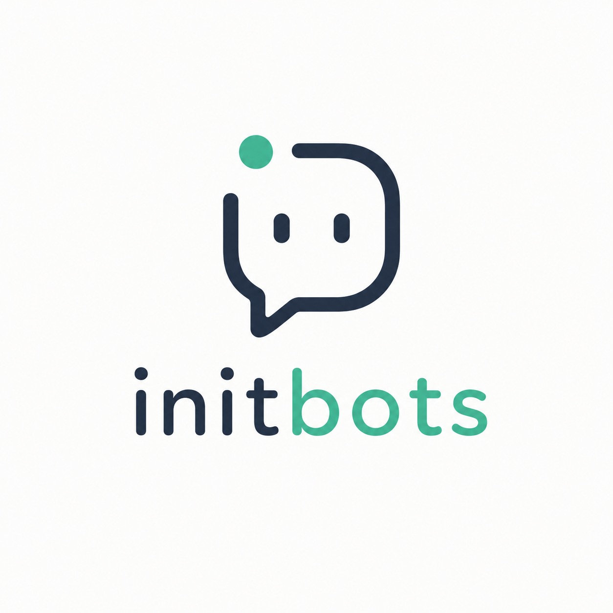

<h1 align="center">
  
</h1>

<p align="center"><strong>Simplifying the process of building chatbots.</strong></p>

<p align="center">
  <a href="https://github.com/initbots-org/website">Website</a>&nbsp;&middot;&nbsp;
  <a href="https://github.com/initbots-org/examples">Examples</a>&nbsp;&middot;&nbsp;
  <a href="https://github.com/initbots-org/skills">Skills</a>&nbsp;&middot;&nbsp;
  <a href="LICENSE">License</a>
</p>

---

InitBots is being built as an opinionated Python framework for creating and operating chatbot backends without rebuilding the surrounding infrastructure.

It will turn configuration, knowledge, and a few Python hooks into an OpenAI-compatible chatbot API. Model providers will be swappable. Reads will be connectors. Writes will be permissioned operations. Tool use will stay bounded.

A generated application will stay this small:

```python
from initbots import init_bot

app = init_bot()
```

Local-first defaults will include FastAPI, SQLite, and Chroma, with optional memory and an integrated admin panel when needed.
